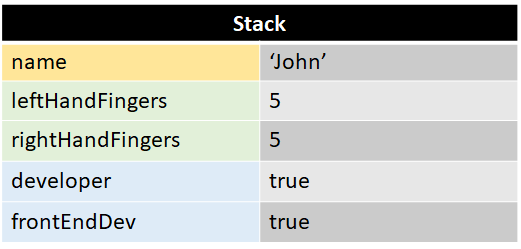
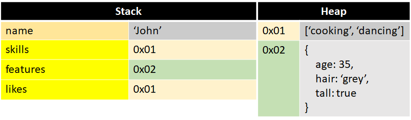
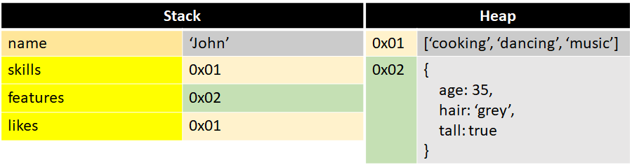

# 4. Value vs Reference Assignment

Em Js existem tipos que são copiados por valor e tipos que são copiados por referencia.

- Copiados por valor:

  - null
  - undefined
  - Number
  - String
  - Boolean

<br>

- Copiados por referência:
  - Object
  - Array
  - Function

Tipos primitivos são copiados por valor e objetos por referência.

## 4.1. Copiados por Valor

```js
const name = `John`;

let leftHandFingers = 5;
let rightHandFingers = leftHandFingers;

console.log(leftHandFingers); // => 5
console.log(rightHandFingers); // => 5

let developer = true;
let frontEndDev = developer;

console.log(developer); // => true
console.log(frontEndDev); // => true
```

Valores primitivos são armazenados na Stack.

<br/>



Apesar de atribuirmos as variáveis `leftHandFingers` à `rightHandFingers` e `developer` à `frontEndDev`, o que é atribuído é o valor da variável, neste caso 5 e true, respectivamente.

Vamos imaginar que algo acontece com `rightHandFingers`. (bata na madeira)

```js
rightHandFingers--;

console.log(rightHandFingers); // => 4
console.log(leftHandFingers); // => 5
```


## 4.2. Copiados por Referência

```js
const name = 'John'
const skills = ['cooking', 'dancing']
const features = {
  age: 35
  hair: 'grey',
  tall: true,
}
```


Objetos em JS são armazenados em uma segunda área de alocação de memória, `Heap`.

As variáveis que recebem um objeto, na verdade recebem uma referência para um endereço dentro da `Heap`.

```js
const likes = skills;

console.log(likes); // => ['cooking', 'dancing']
console.log(skills); // => ['cooking', 'dancing']
```



Caso uma variável, que tem como valor um objeto, seja atribuída a outra variável, o valor passado é a referência do endereço na `Heap`.

```js
likes.push('music');

console.log(likes); // => ['cooking', 'dancing', 'music']
console.log(skills); // => ['cooking', 'dancing', 'music']

console.log(likes === skills); // => true
```



Como as duas variáveis apontam para o mesmo endereço no `Heap`, se fizermos uma alteração em likes, skills também é alterada.

```js
const skills = ['cooking', 'dancing', 'music'];
const likes = ['cooking', 'dancing', 'music'];

console.log(skills === likes); // => false
```


Embora o "mesmo" array seja atribuído, uma referência é independente da outra. As variáveis apontam para endereços diferente na `Heap`.

## 4.3. Copiando Objetos

```js
const person = {
  species: 'human',
  name: 'John',
  age: 35,
};

const spreadPerson = {
  ...person,
};

const jsonParsePerson = JSON.parse(JSON.stringify(person));

const objectAssignPerson = Object.assign({}, person);

// Object.assign ainda pode receber um terceiro parâmetro (objeto) que permite adicionar ou sobrescrever propriedades
const julia = Object.assign({}, person, {
  name: 'Julia',
  age: 27,
  hair: 'blue',
});

console.log(person); // => {species: 'human', name: 'John', age: 35}

console.log(spreadPerson); // => {species: 'human', name: 'John', age: 35}

console.log(jsonParsePerson); // => {species: 'human', name: 'John', age: 35}

console.log(objectAssignPerson); // => {species: 'human', name: 'John', age: 35}

console.log(julia); // => {species: 'human', name: 'Julia', age: 27, hair: 'blue'}
```

## 4.4 Copiando Arrays

```js
const numbersArray = [2, 4, 6, 8, 10];

const spreadArray = [...numbersArray];

const sliceArray = numbersArray.slice();

const concatArray = [].concat(numbersArray);

console.log(numbersArray); // => (5) [2, 4, 6, 8, 10]

console.log(spreadArray); // => (5) [2, 4, 6, 8, 10]

console.log(sliceArray); // => (5) [2, 4, 6, 8, 10]

console.log(concatArray); // => (5) [2, 4, 6, 8, 10]
```

> ## Sugestão de leitura

<br/>

> [Back to roots: JavaScript Value vs Reference - Medium](https://medium.com/dailyjs/back-to-roots-javascript-value-vs-reference-8fb69d587a18)

> [Reference Vs Value - Most People Don't Understand This - Web Dev Simplified Blog](https://blog.webdevsimplified.com/2021-03/js-reference-vs-value/)

> [Quick Tip: How JavaScript References Work - sitepoint.com](https://www.sitepoint.com/how-javascript-references-work/#:~:text=The%20Bottom%20Line%20on%20JavaScript%20References&text=On%20variable%20assignment%2C%20the%20scalar,at%20other%20variables%2C%20or%20references.)

> [The Difference Between Values and References in JavaScript - dmitripavlutin.com](https://dmitripavlutin.com/value-vs-reference-javascript/)

> [JavaScript Primitive vs. Reference Values - javascripttutorial.net](https://www.javascripttutorial.net/javascript-primitive-vs-reference-values/)

> [How to get a grip on reference vs value in JavaScript - freeCodeCamp](https://www.freecodecamp.org/news/how-to-get-a-grip-on-reference-vs-value-in-javascript-cba3f86da223/)

> [3 Ways to Copy Objects in JavaScript - javascripttutorial.net](https://www.javascripttutorial.net/object/3-ways-to-copy-objects-in-javascript/)

> [Copying Objects in JavaScript - DigitalOcean](https://www.digitalocean.com/community/tutorials/copying-objects-in-javascript)

> [3 Ways to Copy or Clone Array in Javascript - https://holycoders.com](https://holycoders.com/javscript-copy-array/)

> [ES6 Way to Clone an Array - holycoders.com](https://www.samanthaming.com/tidbits/35-es6-way-to-clone-an-array/)

> [How to clone an array in JavaScript - freeCodeCamp](https://www.freecodecamp.org/news/how-to-clone-an-array-in-javascript-1d3183468f6a/)

> [How to differentiate between deep and shallow copies in JavaScript - freeCodeCamp](https://www.freecodecamp.org/news/copying-stuff-in-javascript-how-to-differentiate-between-deep-and-shallow-copies-b6d8c1ef09cd/)

> [What is shallow copy and deep copy in JavaScript ? - GeeksforGeeks](https://www.geeksforgeeks.org/what-is-shallow-copy-and-deep-copy-in-javascript/)

> [Shallow copy - MDN](https://developer.mozilla.org/en-US/docs/Glossary/Shallow_copy)

> [Deep copy - MDN](https://developer.mozilla.org/en-US/docs/Glossary/Deep_copy)

> [JavaScript's Memory Management Explained - felixgerschau.com](https://felixgerschau.com/javascript-memory-management/)

**[⬆ Voltar para o índice](./README.md#javascript---advanced-concepts)**
