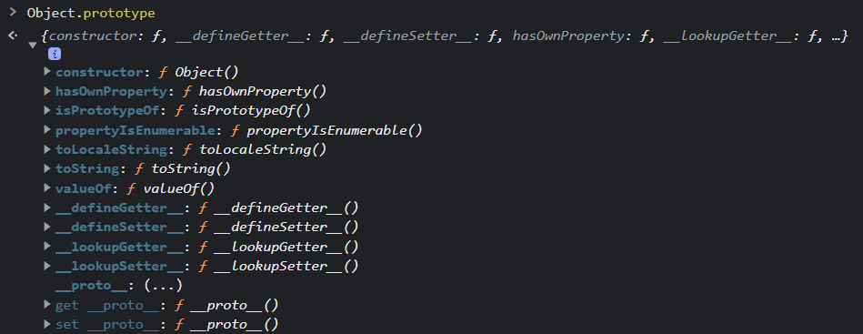
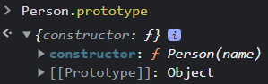
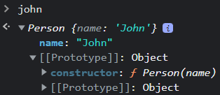

# 8. Prototype

JS é uma linguagem de programação `prototype-based`, da qual é possível reutilizar objetos já existentes que servem de protótipos.

Objetos podem herdar propriedades e métodos de outros objetos por meio do `[[Prototype]]`

O `[[Prototype]]` é um objeto, ou seja, ele tem o seu próprio `[[Prototype]]`. Isso faz com que uma cadeia de protótipos seja criada, a `prototype chain`, sendo eventualmente concluída quando um `[[Prototype]]` tem o valor de `null`

```js
const person = {};

person;
```


Criamos `person`, um objeto vazio mas que contém a propriedade `[[Prototype]]` como valor de `Object` .

Vamos adicionar algumas propriedades a este objeto

```js
person.name = 'John';
person.age = 35;
```

Agora, além de `[[Prototype]]`, temos as propriedades `name` e `age` em `person`.


Mas afinal, o que é o `[[Prototype]]`?

`[[Prototype]]` é uma propriedade privada presente em todos os objetos JS, essa propriedade tem a referência do `prototype` do objeto atual.


Apesar de ser uma propriedade privada de `person`, pelo browser é possível visualizar os métodos do objeto `[[Prototype]]`.

## 8.1. [[Prototype]] X \_\_proto\_\_

Como podemos perceber na imagem acima, dentro de `[[Prototype]]` existe uma propriedade `__proto__`, que é uma propriedade de `Object.prototype`. A Propriedade `__proto__` expõe `[[Prototype]]` e nos permite acessar ou modificar suas propriedades.



```js
person.__proto__ === Object.prototype; // => true
```

Neste caso, a asserção é valida e retorna `true` pois tanto `person.__proto__` quanto `Object.prototype` tem a referência do mesmo objeto em memória.

## 8.2. .prototype

`.prototype` é uma propriedade presente qualquer `Function Expression`.

Métodos e funções declaradas com a sintaxe de `arrow function` não recebem `.prototype`

```js
function functionExpression() {}
const arrowFunction = () => {};

functionExpression.prototype; // => {constructor: ƒ}
arrowFunction.prototype; // => undefined

const obj = {
  functionExpression: function () {},
  arrowFunction: () => {},
};

obj.functionExpression.prototype; // => {constructor: ƒ}
obj.arrowFunction.prototype; // => undefined
```

`.prototype` contêm uma referência para um objeto que será o `[[Prototype]]` do novo objeto criado quando uma função construtora for executada.

```js
function Person(name) {
  this.name = name;
}

Person.prototype; // => {constructor: ƒ}
```

  

```js
const john = new Person('John');

john;
```

  

```js
john.__proto__ === Person.prototype; // => true
```

  

Aqui podemos observar que o objeto `john` tem como `__proto__` - a propriedade que expõe `[[Prototype]]` - um objeto que contém a função construtora `Person` como valor da propriedade `constructor`; `Person`, por sua vez, recebe a propriedade `.prototype` por ser uma `Constructor Function`.

Por convenção, as `Constructor Functions` são declaradas em `PascalCase`, com a primeira letra em maiúsculo.

> ## Sugestão de leitura

<br/>

> [JavaScript Prototype - www.javascripttutorial.net](https://www.javascripttutorial.net/javascript-prototype/)

> [JavaScript Constructor Function - www.javascripttutorial.net](https://www.javascripttutorial.net/javascript-constructor-function/)

> [Object prototypes - MDN](https://developer.mozilla.org/en-US/docs/Learn/JavaScript/Objects/Object_prototypes)

> [Function.prototype.prototype - MDN](https://developer.mozilla.org/en-US/docs/Web/JavaScript/Reference/Global_Objects/Function/prototype)

> [Prototype in JavaScript - www.tutorialsteacher.com](https://www.tutorialsteacher.com/javascript/prototype-in-javascript)

> [JavaScript Prototype Explained with Examples - www.javascripttutorial.net](https://www.freecodecamp.org/news/javascript-prototype-explained-with-examples/)

> [[[Prototype]] vs \_\_proto\_\_ vs .prototype in Javascript - medium.com](https://medium.com/@eamonocallaghan/prototype-vs-proto-vs-prototype-in-javascript-6758cadcbae8)

> [Inheritance and the prototype chain - MDN](https://developer.mozilla.org/en-US/docs/Web/JavaScript/Inheritance_and_the_prototype_chain#constructors)

> [Understanding Prototype Chain And Inheritance in JavaScript - hackernoon.com](https://hackernoon.com/understanding-prototype-chain-and-inheritance-in-javascript-5c2w31oa)

> [JavaScript Prototypes and Inheritance – and Why They Say Everything in JS is an Object - www.freecodecamp.org](https://www.freecodecamp.org/news/prototypes-and-inheritance-in-javascript/)

> [JavaScript Prototypal Inheritance - www.javascripttutorial.net](https://www.javascripttutorial.net/javascript-prototypal-inheritance/)

**[⬆ Voltar para o índice](./README.md#javascript---advanced-concepts)**
