# JavaScript - Advanced Concepts

- [JavaScript - Advanced Concepts](#javascript---advanced-concepts)
- [1. Scope](#1-scope)
  - [1.1. Scope](#11-scope)
  - [1.2. Visibility](#12-visibility)
  - [1.3. Scope in JS](#13-scope-in-js)
    - [1.3.1. Global Scope](#131-global-scope)
    - [1.3.2. Function | Local Scope](#132-function--local-scope)
    - [1.3.3. Block scope](#133-block-scope)
- [2. Closures in JS](#2-closures-in-js)
- [3. Hoisting](#3-hoisting)
  - [3.1. let / const](#31-let--const)
  - [3.2. Classes](#32-classes)
  - [3.3. Function e Class expression](#33-function-e-class-expression)
- [4. Value vs Reference Assignment](#4-value-vs-reference-assignment)
  - [4.1. Copiados por Valor](#41-copiados-por-valor)
  - [4.2. Copiados por Referência](#42-copiados-por-referência)
  - [4.3. Copiando Objetos](#43-copiando-objetos)
  - [4.4 Copiando Arrays](#44-copiando-arrays)
- [5. Spread Operator | Rest Parameters](#5-spread-operator--rest-parameters)
  - [5.1. Spread Operator](#51-spread-operator)
  - [5.2. Rest Parameters](#52-rest-parameters)
- [6. Destructuring](#6-destructuring)
  - [6.1. Arrays](#61-arrays)
  - [6.2. Objetos](#62-objetos)
  - [6.3. Exemplos](#63-exemplos)
- [7. this](#7-this)
  - [7.1. this no contexto Global](#71-this-no-contexto-global)
  - [7.2. this no contexto Funcional](#72-this-no-contexto-funcional)
    - [7.2.1. Default Binding](#721-default-binding)
    - [7.2.2. Implicit Binding](#722-implicit-binding)
    - [7.2.3. Explicit Binding](#723-explicit-binding)
    - [7.2.3.1. call() e apply()](#7231-call-e-apply)
    - [7.2.3.2. bind()](#7232-bind)
    - [7.2.4. Constructor Call Binding](#724-constructor-call-binding)
  - [7.3 this e eventos HTML](#73-this-e-eventos-html)
- [8. Prototype](#8-prototype)
  - [8.1. [[Prototype]] X \_\_proto\_\_](#81-prototype-x-__proto__)
  - [8.2. .prototype](#82-prototype)
- [async](#async)
- [Currying](#currying)

<br/>

---

# 1. Scope

## 1.1. Scope

A região dentro de um programa do qual a variável pode ser referenciada através de seu nome.

O Escopo determina a acessibilidade, **visibilidade** , das variáveis.

Ele é o contexto atual de execução onde valores e expressões estão visíveis ou podem ser executadas. Se a variável ou a expressão não faz parte do escopo atual, ela não estará disponível para uso.

## 1.2. Visibility

O termo visibilidade está mais relacionado à Classes. Ele é aplicado aos membros da classe (atributos ou métodos) e determina um controle de acesso a partir de fora da classe onde eles são declarados.

A Visibilidade é definida por modificadores de acesso.

```js
const isScopeDifferentThanVisibilityInTheory = scope !== visibility;
// => true
```

## 1.3. Scope in JS

JavaScript é uma linguagem de programação que tem escopo léxico, ou seja, é possível acessar variáveis de um escopo externo a partir de um escopo interno, mas não vice-versa.

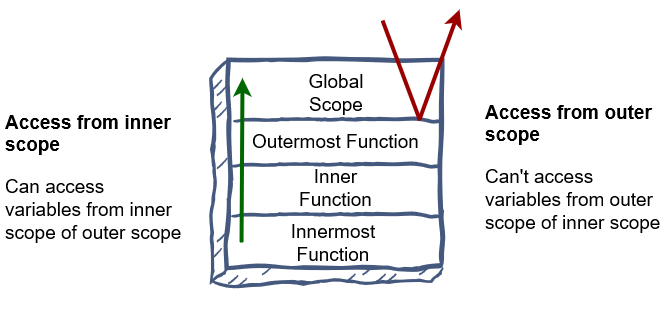

```js
function outerScope() {
  const outer = `from outter scope`;
  console.log(outer);
  console.log(inner); // => ReferenceError: inner is not defined

  function innerScope() {
    const inner = `from inner scope`;
    console.log(inner);
    console.log(outer);
  }
}

outerScope();
```

Existem 3 escopos em JS:

> Global Scope - Escopo Global

> Function | Local Scope - Escopo de função | Escopo Local

> Block Scope - Escopo de bloco

<br>

### 1.3.1. Global Scope

É o escopo padrão para todo o código. O mais externo.

Variáveis definidas no escopo global podem ser acessadas de qualquer lugar em um programa JS.

```js
let myName = `John`;
// myName é acessível no escopo global.

function sayMyName() {
  // myName é acessível aqui também.
}
```

Variáveis declaradas fora de uma função são declaradas no escopo global.

Seja ela declarada com `var` | `let` | `const`.

```js
// myName, herName, myDogsName são acessíveis no escopo global.
let myName = `John`;
var herName = `Julia`;
const myDogsName = `Cacau`;

function sayMyName() {
  function sayMyAge() {
    // myName, herName, myDogsName são acessíveis aqui também.
  }
}
```

Caso um valor seja atribuído a uma variável que não foi declarada, ela automaticamente se torna uma variável global.

```js
sayMyName();

// myName é acessível no escopo global mesmo sendo declarada dentro da função.
console.log(`escopo global`, myName); // => '`escopo global John'

function sayMyName() {
  myName = `John`;

  function sayMyAge() {
    console.log(`escopo sayMyAge`, myName); // => 'escopo sayMyAge John'
  }
  sayMyAge();
}
```

Não é um boa prática atribuir um valor a uma variável sem declara-la antes.

### 1.3.2. Function | Local Scope

Uma declaração de função em JS cria um novo escopo.

```js
function sayMyName() {
  // Escopo da função sayMyName.
  // Escopo referente a este local.
}
```

Variáveis definidas dentro da função não são acessíveis, "visíveis", de fora dela.

Seja ela declarada com `var` | `let` | `const`.

```js
// myName, herName, myDogsName não são acessíveis no escopo global.
console.log(myName); // => ReferenceError: myName is not defined
console.log(herName); // => ReferenceError: herName is not defined
console.log(myDogsName); // => ReferenceError: myDogsName is not defined

function sayMyName() {
  let myName = `John`;
  var herName = `Julia`;
  const myDogsName = `Cacau`;

  // myAge, herAge, myDogsAge não são acessíveis aqui.
  console.log(myAge); // => ReferenceError: myAge is not defined
  console.log(herAge); // => ReferenceError: herAge is not defined
  console.log(myDogsAge); // => ReferenceError: myDogsAge is not defined

  function sayMyAge() {
    // myName, herName, myDogsName podem ser acessadas aqui.
    let myAge = 35;
    var herAge = 27;
    const myDogsAge = 4;
  }
}
```

### 1.3.3. Block scope

Anteriormente ao ES6 (2015), existiam somente o escopo Global e o Escopo Local | Escopo de Função.

Com a introdução de let e const, foi definido mais um tipo de escopo, o escopo de bloco

Um bloco de código em Js é definido por código escrito dentro de `{ }`

```js
// inicio de bloco
{
  let message = `from inside a block of code`;
  const otherMessage = `from inside the same block of code`;

  console.log(message); // => 'from inside a block of code'
  console.log(otherMessage); // => 'from inside the same block of code'
}
//fim de bloco

console.log(message); // => ReferenceError: message is not defined
console.log(otherMessage); // => ReferenceError: otherMessage is not defined
```

Variáveis declaradas com `var` não possuem escopo de bloco, e podem ser acessadas de fora do bloco de código.

```js
{
  var message = `from inside a block of code`;

  console.log(message); // => 'from inside a block of code'
}

console.log(message); // => 'from inside a block of code'
```

`const` e `let` resolvem o problema de vazamento de variáveis declaradas com var em escopo de bloco.

Outro exemplo desse vazamento é a declaração da variável de inicialização do `for` loop

```js
for(var i = 0, i < 10, i++){}
console.log(i) // => 10

for(let i = 0, i < 10, i++){}
console.log(i) // => ReferenceError: i is not defined
```

> ## Sugestão de leitura

<br/>

> [Scope - MDN](https://developer.mozilla.org/en-US/docs/Glossary/Scope)

> [Lexical Scope in JavaScript – Beginners Guide - freeCodeCamp](https://www.freecodecamp.org/news/lexical-scope-in-javascript/)

> [Lexical Scope in JavaScript – What Exactly Is Scope in JS? - freeCodeCamp](https://www.freecodecamp.org/news/javascript-lexical-scope-tutorial/)

> [Lexical Scope in JavaScript - educative.io](https://www.educative.io/answers/lexical-scope-in-javascript)

> [JavaScript Variable Scopes - javascripttutorial.net](https://www.javascripttutorial.net/javascript-variable-scope/#)

**[⬆ Voltar para o topo](#javascript---advanced-concepts)**

<br/>

---

# 2. Closures in JS

Closures são funções que fazem referência a variáveis declaradas no seu escopo léxico, transformando-as em variáveis privadas e persistindo seus valores.

Qualquer função em JS pode ser uma closure.

JavaScript usa o escopo para o gerenciamento de acesso a variáveis.

```js
let name = `John`;

function greetings() {
  let message = `Hi`;
  console.log(`${message} ${name}`);
}

greetings(); // => 'Hi John'
```

Mesmo sendo declarada fora do escopo de greetings, no escopo global neste caso, a função tem acesso a variável `name` declarada no escopo mais externo.

Isso traz um problema, qualquer código na página tem acesso a `name` e pode alterar o seu valor sem a necessidade de executar `greetings`.

A variável `message` é local e só pode ser acessada dentro de `greetings`. Se tentarmos acessa-la de fora, obteremos um erro.

```js
function birthday(years) {
  let age = years;

  function celebrate() {
    const birthdayMessage = `Hoje é meu aniversário de ${age} anos.`;
    console.log(birthdayMessage);
  }
  celebrate();
}

birthday(35); // => Hoje é meu aniversário de 35 anos.
birthday(27); // => Hoje é meu aniversário de 27 anos.
```

Neste trecho de código, a função `birthday` cria uma variável local, `age`, e também a função `celebrate`, que por sua vez cria uma variável local, `birthdayMessage`.

`celebrate` é a função mais interna e só está disponível no escopo da função `birthday`.

A função `celebrate` tem acesso a variável `age`, definida em `birthday`, mas `birthday` não tem acesso a `birthdayMessage`.

Vamos modificar a função `birthday`.

```js
function birthday(name, years) {
  let person = name;
  let age = years;

  function celebrate() {
    const birthdayMessage = `Meu nome é ${person} e hoje é meu aniversário de ${age} anos.`;
    age++;
    console.log(birthdayMessage);
  }
  return celebrate;
}

const johnsBday = birthday('John', 35);
const juliasBday = birthday('Julia', 27);
```

```js
johnsBday(); // => 'Meu nome é John e hoje é meu aniversário de 35 anos'
juliasBday(); // => 'Meu nome é Julia e hoje é meu aniversário de 27 anos'
```


```js
johnsBday(); // => 'Meu nome é John e hoje é meu aniversário de 36 anos'
juliasBday(); // => 'Meu nome é Julia e hoje é meu aniversário de 28 anos'
```

Agora, em vez de executarmos a função `celebrate` dentro de `birthday`, `birthday` retorna o objeto de função `celebrate`.

Como em JS as funções são First-Class Citizens, podemos retornar uma função a partir de outra função.

Fora da função `birthday`, nós atribuímos à `johnsBday` e `juliasBday` o retorno de `birthday` com os seus respectivos argumentos.

Depois executamos as funções `johnsBday` e `juliasBday`.

Como já sabemos, em JS, uma variável local só existe durante o tempo de execução da função, isto é, ao fim da execução de birthday, as variáveis `person` e `age` não existem mais.

Neste caso, nós executamos `johnsBday` | `juliasBday` que faz referência ao retorno de `birthday`, que é a função `celebrate`, e as variáveis ainda persistem.

Uma Closure é uma função que preserva o escopo externo a ela dentro do seu escopo.

> ## Sugestão de leitura

<br/>

> [Closures - MDN](https://developer.mozilla.org/en-US/docs/Web/JavaScript/Closures)

> [Private Members in JavaScript - crockford.com](http://www.crockford.com/javascript/private.html)

> [JavaScript Closures - tutorialsteacher.com](https://www.tutorialsteacher.com/javascript/closure-in-javascript)

> [Javascript: Mas afinal, o que são closures? - Medium](https://medium.com/@stephanowallace/javascript-mas-afinal-o-que-s%C3%A3o-closures-4d67863ca9fc)

> [How to Use Closures in JavaScript – A Beginner's Guide - freeCodeCamp](https://www.freecodecamp.org/news/closures-in-javascript/)

**[⬆ Voltar para o topo](#javascript---advanced-concepts)**

<br/>

---

# 3. Hoisting

Quando um código JS é executado pela sua respectiva engine, ele cria um [contexto global de execução (global execution context)](https://www.javascripttutorial.net/javascript-execution-context/), e ele tem duas fases.

- Criação | Creation
- Execução | Execution

Durante a fase de criação, todas as declarações de variáveis e funções são 'içadas'. Esse içamento é conhecido como Hoisting.

Variáveis definidas com var são "movidas para o topo" e inicializadas com o valor de undefined por padrão.

Note que esse código não gera uma exceção.

```js
console.log(myName); // => undefined

var myName = `John`;

console.log(myName); // => 'John'
```

Tecnicamente esse é o código antes da fase de execução.

```js
var myName; // var myName = undefined

console.log(myName); // => undefined

myName = `John`;

console.log(myName); // => 'John'
```

A referência para a variável `myName` é criada em memória, o escopo é definido, e seu valor é inicializado como `undefined`.

Caso tentemos acessar uma variável inicializada que não foi declarada antes, obtemos um erro de referência.

```js
console.log(myName); // => ReferenceError, o interpretador não conhece myName.

myName = `John`;
```

Entretanto, a inicialização também causa a declaração de uma variável, ou seja, o código abaixo é executado, sem exceções, pois a variável é inicializada e declarada antes de ser utilizada

```js
myName = `John`; // inicialização de myName

console.log(myName); // => 'John'
```

Declarações de função também são 'içadas'.

```js
console.log(sayMyName(`John`));

function sayMyName(name) {
  return `Meu nome é ${name}`;
}
```

ou seja:

```js
function sayMyName(name) {
  return `Meu nome é ${name}`;
}

console.log(sayMyName(`John`));
```

## 3.1. let / const

<br>

Variáveis declaradas com `let` | `const` também são içadas, mas não são inicializadas com o valor padrão de `undefined`.

A leitura de variáveis declaradas com `let` e `const` antes da sua inicialização lança uma exceção.

```js
console.log(myName); // => ReferenceError

let myName = `John`;
```

```js
console.log(myAge); // => ReferenceError

const myAge = 35;
```

## 3.2. Classes

- Class declaration

Uma diferença importante entre class declaration e function declaration é que enquanto uma função pode ser executada antes da sua declaração, o mesmo não acontece com classes.

Declarações de classes sao içadas mas seus valores não são inicializados.

```js
const p = new Pessoa(); // => ReferenceError

class Pessoa {}
```

## 3.3. Function e Class expression

<br>

Function e class expressions tem o mesmo tratamento de declarações de variáveis. A função ou a classe será inicializada na fase de execução do contexto global de execução.

```js
console.log(myFunction); // => ReferenceError

const myFunction = function () {};
```

```js
console.log(myClass) // => ReferenceError

const myClass = class {
  constructor()
};
```

O mesmo acontece utilizando a sintaxe de Arrow functions

```js
console.log(myOtherFunction); // => ReferenceError

const myOtherFunction = () => {};
```

> ## Sugestão de leitura

<br/>

> [Hoisting - MDN](https://developer.mozilla.org/en-US/docs/Glossary/Hoisting)

> [JavaScript Hoisting - W3Schools](https://www.w3schools.com/js/js_hoisting.asp)

> [JavaScript Hoisting - javascripttutorial.net](https://www.javascripttutorial.net/javascript-hoisting/)

> [O que é Hoisting em Javascript? - Medium](https://medium.com/devzera/o-que-%C3%A9-hoisting-em-javascript-b8c629178518)

> [JavaScript Hoisting - Programiz](https://www.programiz.com/javascript/hoisting)

**[⬆ Voltar para o topo](#javascript---advanced-concepts)**

<br/>

---

# 4. Value vs Reference Assignment

Em Js existem tipos que são copiados por valor e tipos que são copiados por referencia.

- Copiados por valor:

  - null
  - undefined
  - Number
  - String
  - Boolean

<br>

- Copiados por referência:
  - Object
  - Array
  - Function

Tipos primitivos são copiados por valor e objetos por referência.

## 4.1. Copiados por Valor

```js
const name = `John`;

let leftHandFingers = 5;
let rightHandFingers = leftHandFingers;

console.log(leftHandFingers); // => 5
console.log(rightHandFingers); // => 5

let developer = true;
let frontEndDev = developer;

console.log(developer); // => true
console.log(frontEndDev); // => true
```

Valores primitivos são armazenados na Stack.

<br/>

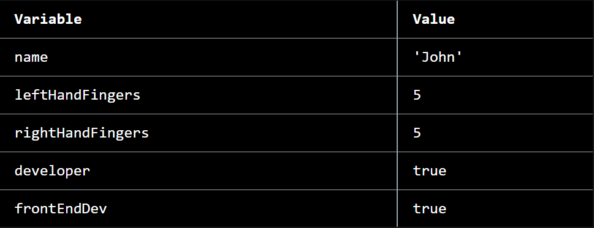

Apesar de atribuirmos as variáveis `leftHandFingers` à `rightHandFingers` e `developer` à `frontEndDev`, o que é atribuído é o valor da variável, neste caso 5 e true, respectivamente.

Vamos imaginar que algo acontece com `rightHandFingers`. (bata na madeira)

```js
rightHandFingers--;

console.log(rightHandFingers); // => 4
console.log(leftHandFingers); // => 5
```

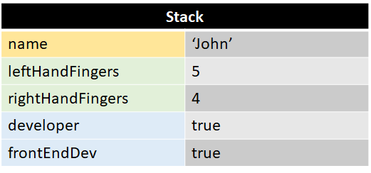

## 4.2. Copiados por Referência

```js
const name = 'John'
const skills = ['cooking', 'dancing']
const features = {
  age: 35
  hair: 'grey',
  tall: true,
}
```

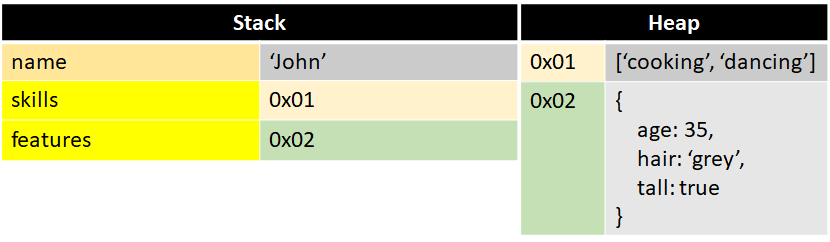

Objetos em JS são armazenados em uma segunda área de alocação de memória, `Heap`.

As variáveis que recebem um objeto, na verdade recebem uma referência para um endereço dentro da `Heap`.

```js
const likes = skills;

console.log(likes); // => ['cooking', 'dancing']
console.log(skills); // => ['cooking', 'dancing']
```

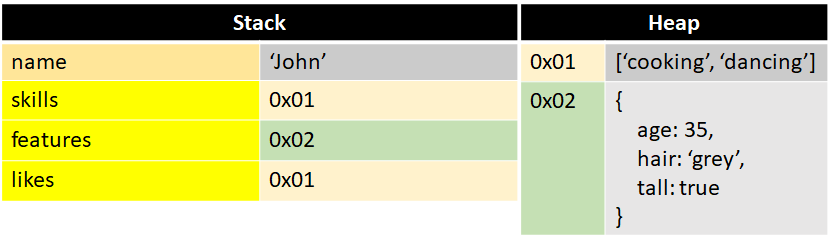

Caso uma variável, que tem como valor um objeto, seja atribuída a outra variável, o valor passado é a referência do endereço na `Heap`.

```js
likes.push('music');

console.log(likes); // => ['cooking', 'dancing', 'music']
console.log(skills); // => ['cooking', 'dancing', 'music']

console.log(likes === skills); // => true
```

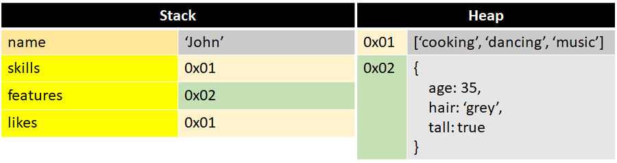

Como as duas variáveis apontam para o mesmo endereço no `Heap`, se fizermos uma alteração em likes, skills também é alterada.

```js
const skills = ['cooking', 'dancing', 'music'];
const likes = ['cooking', 'dancing', 'music'];

console.log(skills === likes); // => false
```

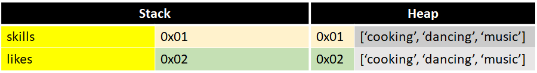

Embora o "mesmo" array seja atribuído, uma referência é independente da outra. As variáveis apontam para endereços diferente na `Heap`.

## 4.3. Copiando Objetos

```js
const person = {
  species: 'human',
  name: 'John',
  age: 35,
};

const spreadPerson = {
  ...person,
};

const jsonParsePerson = JSON.parse(JSON.stringify(person));

const objectAssignPerson = Object.assign({}, person);

// Object.assign ainda pode receber um terceiro parâmetro (objeto) que permite adicionar ou sobrescrever propriedades
const julia = Object.assign({}, person, {
  name: 'Julia',
  age: 27,
  hair: 'blue',
});

console.log(person); // => {species: 'human', name: 'John', age: 35}

console.log(spreadPerson); // => {species: 'human', name: 'John', age: 35}

console.log(jsonParsePerson); // => {species: 'human', name: 'John', age: 35}

console.log(objectAssignPerson); // => {species: 'human', name: 'John', age: 35}

console.log(julia); // => {species: 'human', name: 'Julia', age: 27, hair: 'blue'}
```

## 4.4 Copiando Arrays

```js
const numbersArray = [2, 4, 6, 8, 10];

const spreadArray = [...numbersArray];

const sliceArray = numbersArray.slice();

const concatArray = [].concat(numbersArray);

console.log(numbersArray); // => (5) [2, 4, 6, 8, 10]

console.log(spreadArray); // => (5) [2, 4, 6, 8, 10]

console.log(sliceArray); // => (5) [2, 4, 6, 8, 10]

console.log(concatArray); // => (5) [2, 4, 6, 8, 10]
```

> ## Sugestão de leitura

<br/>

> [Back to roots: JavaScript Value vs Reference - Medium](https://medium.com/dailyjs/back-to-roots-javascript-value-vs-reference-8fb69d587a18)

> [Reference Vs Value - Most People Don't Understand This - Web Dev Simplified Blog](https://blog.webdevsimplified.com/2021-03/js-reference-vs-value/)

> [Quick Tip: How JavaScript References Work - sitepoint.com](https://www.sitepoint.com/how-javascript-references-work/#:~:text=The%20Bottom%20Line%20on%20JavaScript%20References&text=On%20variable%20assignment%2C%20the%20scalar,at%20other%20variables%2C%20or%20references.)

> [The Difference Between Values and References in JavaScript - dmitripavlutin.com](https://dmitripavlutin.com/value-vs-reference-javascript/)

> [JavaScript Primitive vs. Reference Values - javascripttutorial.net](https://www.javascripttutorial.net/javascript-primitive-vs-reference-values/)

> [How to get a grip on reference vs value in JavaScript - freeCodeCamp](https://www.freecodecamp.org/news/how-to-get-a-grip-on-reference-vs-value-in-javascript-cba3f86da223/)

> [3 Ways to Copy Objects in JavaScript - javascripttutorial.net](https://www.javascripttutorial.net/object/3-ways-to-copy-objects-in-javascript/)

> [Copying Objects in JavaScript - DigitalOcean](https://www.digitalocean.com/community/tutorials/copying-objects-in-javascript)

> [3 Ways to Copy or Clone Array in Javascript - https://holycoders.com](https://holycoders.com/javscript-copy-array/)

> [ES6 Way to Clone an Array - holycoders.com](https://www.samanthaming.com/tidbits/35-es6-way-to-clone-an-array/)

> [How to clone an array in JavaScript - freeCodeCamp](https://www.freecodecamp.org/news/how-to-clone-an-array-in-javascript-1d3183468f6a/)

> [How to differentiate between deep and shallow copies in JavaScript - freeCodeCamp](https://www.freecodecamp.org/news/copying-stuff-in-javascript-how-to-differentiate-between-deep-and-shallow-copies-b6d8c1ef09cd/)

> [What is shallow copy and deep copy in JavaScript ? - GeeksforGeeks](https://www.geeksforgeeks.org/what-is-shallow-copy-and-deep-copy-in-javascript/)

> [Shallow copy - MDN](https://developer.mozilla.org/en-US/docs/Glossary/Shallow_copy)

> [Deep copy - MDN](https://developer.mozilla.org/en-US/docs/Glossary/Deep_copy)

> [JavaScript's Memory Management Explained - felixgerschau.com](https://felixgerschau.com/javascript-memory-management/)

**[⬆ Voltar para o topo](#javascript---advanced-concepts)**

<br/>

---

# 5. Spread Operator | Rest Parameters

Os operadores `Spread` e `Rest` tem sintaxe idêntica,`...`, mas eles diferem em funcionalidade.

A principal diferença entre eles é que o Rest Parameters é utilizado para armazenar o resto de uma lista de valores ou argumentos de uma função em um Array e o Spread Operator é utilizado para expandir iteráveis em valores individuais.

## 5.1. Spread Operator

- Arrays

```js
const frameworks = ['React', 'Angular', 'Vue'];

const technologies = ['HTML', 'CSS', 'JavaScript', ...frameworks];

console.log(frameworks); // => (6) ['HTML', 'CSS', 'JavaScript','React', 'Angular', 'Vue']
```

- Objetos

```js
const workInfo = {
  developer: true,
  frontEndDev: true,
  company: 'Valtech',
};

const johnDev = {
  name: 'John',
  age: 35,
  ...workInfo,
};

console.log(johnDev); // => {name: 'John', age: 35, developer: true, frontEndDev: true, company: 'Valtech'}
```

- Strings

```js
const message = 'Hello World!';

const letters = [...message];

console.log(letters); // => ['H', 'e', 'l','l' ,'o' ,' ' ,'W', 'o', 'r' ,'l' ,'d' , '!']
```

## 5.2. Rest Parameters

```js
function sum(...numbers) {
  return numbers.reduce((acc, cur) => acc + cur, 0);
}

console.log(sum(2, 4, 6, 8, 10)); // => 30
```

```js
function petOwner(person, ...pets) {
  console.log(`Olá, meu nome é ${person}`);
  console.log(
    `Eu tenho ${pets.length} ${pets.length <= 1 ? 'pet.' : 'pets.'} `
  );
  console.log(
    `${pets.length <= 1 ? 'O nome dele(a) é:' : 'Os nomes deles(as) são:'} `
  );

  for (const pet of pets) {
    console.log(pet);
  }
}

petOwner('John', 'Cacau');
// => 'Olá, meu nome é John'
// => 'Eu tenho um pet.'
// => 'O nome dele(a) é:'
// => 'Cacau'
```

> ## Sugestão de leitura

<br/>

> [Rest parameters - MDN](https://developer.mozilla.org/en-US/docs/Web/JavaScript/Reference/Functions/rest_parameters)

> [JavaScript: Operadores Rest e Spread - devMedia.com.br](https://www.devmedia.com.br/javascript-operadores-rest-e-spread/41200)

> [JavaScript Rest vs Spread Operator – What’s the Difference? - freeCodeCamp](https://www.freecodecamp.org/news/javascript-rest-vs-spread-operators/)

> [Rest parameters and spread syntax - javascript.info](https://javascript.info/rest-parameters-spread)

> [An Easy Guide to Object Rest/Spread Properties in JavaScript - dmitripavlutin.com](https://dmitripavlutin.com/object-rest-spread-properties-javascript/)

> [Spread operator vs rest parameters - Medium](https://medium.com/trainingcenter/spread-operator-vs-rest-parameters-f8688d8e1761)

> [Como funcionam o Rest e o Spread Operator- horadecodar.com.br](https://www.horadecodar.com.br/2019/03/19/como-funcionam-o-rest-e-o-spread-operator/)

> [Spread e Rest operators em JavaScript - blog.cod3r.com.br](https://blog.cod3r.com.br/spread-rest/)

> [What is the rest parameter and spread operator in JavaScript - GeeksforGeeks](https://www.geeksforgeeks.org/what-is-the-rest-parameter-and-spread-operator-in-javascript/)

> [JavaScript Rest Parameters - javascripttutorial.net](https://www.javascripttutorial.net/es6/javascript-rest-parameters/)

> [JJavaScript Object Spread - javascripttutorial.net](https://www.javascripttutorial.net/es-next/javascript-object-spread/)

**[⬆ Voltar para o topo](#javascript---advanced-concepts)**

<br/>

---

# 6. Destructuring

A sintaxe do Destructuring Assignment é uma expressão em Js que nos permite extrair valores de arrays e propriedades de objetos e armazena-los em variáveis.

## 6.1. Arrays

```js
const technologies = ['JavaScript', 'HTML', 'CSS'];

/*
  js = technologies[0]
  html = technologies[1]
  css = technologies[2]
*/

const [js, html, css] = technologies;

console.log(js); // => 'JavaScript'
console.log(html); // => 'HTML'
console.log(css); // => 'CSS'
```

## 6.2. Objetos

```js
const person = {
  name: 'John',
  age: 35,
  developer: true,
};

/*
  name = person.name
  age = person.age
  developer = person.developer
*/

const { name, age, developer } = person;

console.log(name); // => 'John'
console.log(age); // => 35
console.log(developer); // => true
```

<br>

## 6.3. Exemplos

Se tentarmos atribuir um valor inexistente a uma variável, ela recebe o valor de `undefined`.

- Arrays

```js
const technologies = ['JavaScript', 'HTML', 'CSS'];

const [js, html, css, react] = technologies;

console.log(react); // => undefined
```

- Objetos

```js
const person = {
  name: 'John',
  age: 35,
  developer: true,
};

const { name, age, developer, tall } = person;

console.log(tall); // => undefined
```

<br>

Podemos extrair valores singulares e armazenar os valores restantes.

- Arrays

```js
const technologies = ['JavaScript', 'HTML', 'CSS', 'React', 'Angular', 'Vue'];

const [js, html, css, ...frameworks] = technologies;

console.log(js); // => 'JavaScript'
console.log(html); // => 'HTML'
console.log(css); // => 'CSS'
console.log(frameworks); // => (3) ['React', 'Angular', 'Vue']
```

- Objetos

```js
const person = {
  name: 'John',
  age: 35,
  developer: true,
  frontEndDev: true,
  company: 'Valtech',
};

const { name, age, ...workInfo } = person;

console.log(name); // => 'John'
console.log(age); // =>35
console.log(workInfo); // => {developer: true, frontEndDev: true, company: 'Valtech'}
```

<br>

Alguns valores podem ser ignorados.

- Arrays

Com o uso do operador `,` (vírgula | comma) .

```js
const technologies = ['JavaScript', 'HTML', 'CSS', 'React', 'Angular', 'Vue'];

const [js, , css, react] = technologies;

console.log(js); // => 'JavaScript'
console.log(css); // => 'CSS'
console.log(react); // => 'React'
```

Neste trecho de código os indices `[1]`, `[4]` e `[5]` não foram atribuídos a variáveis.

- Objetos

```js
const person = {
  name: 'John',
  age: 35,
  developer: true,
  frontEndDev: true,
  company: 'Valtech',
};

const { name, age, company } = person;

console.log(name); // => 'John'
console.log(age); // =>35
console.log(company); // => 'Valtech'
```

<br>

Variáveis podem ser declaradas e inicializadas posteriormente.

- Arrays

```js
const js,html, css, react, angular, vue

function webDevTechStack(){
  const technologies = ['JavaScript','HTML','CSS','React','Angular','Vue'];

  return technologies
}

[js,html, , , angular, vue] = webDevTechStack();

console.log(js); // => 'JavaScript'
console.log(react); // => undefined
console.log(vue); // => 'Vue'
```

- Objetos

```js
const name, age, frontEndDev;

const person = {
  name: 'John',
  age: 35,
  developer: true,
  frontEndDev: true,
  company: 'Valtech'
};

// a expressão precisa ser executada dentro de ()
({name, age,frontEndDev } = person)

console.log(name); // => 'John'
console.log(age); // => 35
console.log(frontEndDev); // => true
```

Expressão não executada:

```js
const name, age, frontEndDev;

const person = {
  name: 'John',
  age: 35,
  developer: true,
  frontEndDev: true,
  company: 'Valtech'
};

{name, age,frontEndDev } = person; // => Uncaught SyntaxError: Unexpected token '='
```

<br>

Valores padrão podem ser atribuídos.

- Arrays

```js
function webDevTechStack() {
  const technologies = ['JavaScript', 'HTML', 'CSS', 'React', 'Angular', 'Vue'];

  return technologies;
}

const [js, html, css, react, angular, vue, docker = 'Docker'] =
  webDevTechStack();

console.log(js); // => 'JavaScript'
console.log(angular); // => 'Angular'
console.log(docker); // => 'Docker'
```

- Objetos

```js
function webDev() {
  const person = {
    name: 'John',
    age: 35,
    developer: true,
    frontEndDev: true,
    company: 'Valtech',
  };

  return person;
}

const { name, age, frontEndDev, dogsName = 'Cacau' } = webDev();

console.log(name); // => 'John'
console.log(developer); // => true
console.log(dogsName); // => 'Cacau'
```

Valores padrão só podem ser atribuídos caso a variável não exista ou o seu valor seja `undefined`.
Quaisquer outros valores incluindo `null`, `false` ou `0` são ignorados pelo Default assignment.

- Arrays

```js
function webDevTechStack() {
  const technologies = ['JavaScript', 'HTML', 'CSS'];

  return technologies;
}

const [js = 'java_script', html, css] = webDevTechStack();

console.log(js); // => 'JavaScript'
```

- Objetos

```js
function webDev() {
  const person = {
    name: 'John',
    age: 35,
    developer: true,
  };
  return person;
}

const { name = 'Mello', age, developer } = webDev();

console.log(name); // => 'John'
```

<br>

Se as funções `webDevTechStack` e `webDev` retornassem outro valor que não um array ou um objeto, neste cenário onde `array` & `objeto` são esperados, uma exceção seria lançada.

```js
function webDevTechStack() {
  const technologies = null;
  return technologies;
}

function webDev() {
  const person = null
  return person;


const [js, html, css] = webDevTechStack(); // => Uncaught TypeError: webDevTechStack is not a function or its return value is not iterable

const {name, age, developer} = webDev(); // => Uncaught TypeError: webDev is not a function or its return value is not iterable
```

A sintaxe de Destructuring também se aplica a arrays e objetos aninhados.

- Arrays

```js
const person = ['John', 'Mello', ['JavaScript', 'HTML', 'CSS']];

const [firstName, lastName, [...technologies]] = person;

console.log(firstName); // => 'John'
console.log(lastName); // => 'Mello'
console.log(technologies); // => (3) ['JavaScript', 'HTML', 'CSS']
```

- Objetos

```js
const person = {
  name: 'John',
  age: 35,
  workInfo: {
    developer: true,
    frontEndDev: true,
    company: 'Valtech',
  },
};

const {
  name,
  age,
  workInfo: { ...workInfo },
} = person;

console.log(name); // => 'John'
console.log(age); // => 'Mello'
console.log(workInfo); // => {developer: true, frontEndDev: true, company: 'Valtech'}
```

A sintaxe de Object Destructuring ainda nos permite definir aliases para os valores obtidos a partir do objeto original com o uso do operador `:` (dois pontos | colon).

```js
function webDev() {
  const person = {
    name: 'John',
    age: 35,
    developer: true,
  };
  return person;
}

const { name: firstName, age, developer } = webDev();

console.log(firstName); // => 'John'
```

> ## Sugestão de leitura

<br/>

> [Destructuring assignment - MDN](https://developer.mozilla.org/en-US/docs/Web/JavaScript/Reference/Operators/Destructuring_assignment)

> [ES6 Destructuring Assignment - javascripttutorial.net](https://www.javascripttutorial.net/es6/destructuring/)

> [JavaScript Object Destructuring - javascripttutorial.net](https://www.javascripttutorial.net/es6/javascript-object-destructuring/)

> [How to Use Array and Object Destructuring in JavaScript - freeCodeCamp](https://www.freecodecamp.org/news/array-and-object-destructuring-in-javascript/)

> [Destructuring in JavaScript – How to Destructure Arrays and Objects - freeCodeCamp](https://www.freecodecamp.org/news/destructuring-patterns-javascript-arrays-and-objects/)

> [Destructuring assignment - javascript.info](https://javascript.info/destructuring-assignment)

> [JavaScript: Destructuring assignment - devmedia.com.br](https://www.devmedia.com.br/javascript-destructuring-assignment/41201)

> [JavaScript · Destructuring Assignment with Default Values - dzaiste.net](https://zaiste.net/posts/javascript-destructuring-assignment-default-values/)

**[⬆ Voltar para o topo](#javascript---advanced-concepts)**

<br/>

---

# 7. this

A palavra chave `this` não é pertinente somente ao JavaScript. Outras linguagens de programação como Java, C#, e PHP utilizam deste artifício com o intuito de representar a instância atual da classe. Entretanto em JavaScript ela se comporta de maneira diferente.

Como `this` é determinado em Runtime, quando uma função é executada, a sua referência pode variar dependendo do que acontece no código.

Em geral, `this` referencia o objeto do qual a função é uma propriedade, o objeto que executa a função naquele determinado momento, e não necessariamente o objeto onde a função foi definida.

`this` sempre faz referência a um objeto e não a uma função. Embora ele seja definido no momento da execução da função, a sua referência é do objeto.

```js
const webDev = {
  name: 'John',
  age: 35,
  developer: true,
  birthday: function () {
    return ++this.age;
  },
};

webDev.birthday(); // => 36
```

Dentro da função `birthday`, `this` faz referência a propriedade `age` do objeto `webDev`.

<br>

## 7.1. this no contexto Global

No contexto Global `this` faz referência a `window` nos browsers, ou a `global` no Node.js

```js
console.log(this === window); // => true

console.log(this); // => Window {window: Window, self: Window, document: document, name: '', location: Location, …}
```

Caso uma propriedade seja atribuída a `this` em contexto Global, ela será atribuída ao objeto global.

```js
this.globalString = 'Global string';

console.log(window.globalString); // => Global string
```

<br>

## 7.2. this no contexto Funcional

Em Js podemos executar uma função de quatro maneiras, ou seja, quatro modos de vincularmos, "binding", `this`

- Function invocation | Execução de função (Default binding)
- Method invocation | Execução de método (Implicit binding)
- Indirect invocation | Execução indireta (Explicit binding )
- Constructor invocation | Execução de Construtor (Constructor Call Binding)

### 7.2.1. Default Binding

Caso um função que foi definida no escopo global contenha uma referência a `this` dentro do seu escopo, no momento da sua execução, `this` é vinculado ao objeto global.

```js
var walterWhite = 'Heisenberg';

function sayMyName() {
  console.log(`You're ${this.walterWhite}`);
}

sayMyName(); // => "You`re Heisenberg"
```

`sayMyName` é uma função simples definida e no escopo global, isso faz com que `this`, neste contexto, referencie o objeto global.

Lembrando que variáveis definidas com a palavra chave `var` são atribuídas ao objeto global.

```js
console.log(this.walterWhite); // => "Heisenberg"

console.log(window.walterWhite); // => "Heisenberg"
```

Variáveis definidas com `let` ou `const` não são atribuídas ao objeto global.

```js
let walterWhite = 'Heisenberg';
//const walterWhite = 'Heisenberg';

function sayMyName() {
  console.log(`You're ${this.walterWhite}`);
}

sayMyName(); // => "You`re undefined"
```

Caso o nosso código seja escrito em strict mode, o que é aconselhável sempre, utilizando a diretriz `'use strict'` no inicio do código ou dentro da função, `this` não é vinculado ao objeto global e o código lança uma exceção.

```js
// 'use strict'

var walterWhite = 'Heisenberg';

function sayMyName() {
  'use strict';
  console.log(`You're ${this.walterWhite}`);
}

sayMyName(); // => Uncaught TypeError: this is undefined
```

### 7.2.2. Implicit Binding

Quando invocamos um método de um objeto utilizando a notação de ponto (`.`), `this` é vinculado ao objeto que invoca o método no momento da execução.

```js
var walterWhite = {
  name: 'Walter White',
  alias: 'Heisenberg',
  sayMyName,
};

function sayMyName() {
  console.log(`You're ${this.alias}`);
}

walterWhite.sayMyName(); // => "You`re Heisenberg"
```

Neste trecho de código, quando executamos `walterWhite.sayMyName()`, `this` é vinculado ao objeto `walterWhite` e `sayMyName()` é capaz de resolver a propriedade `alias`.

```js
var walterWhite = {
  name: 'Walter White',
  alias: 'Heisenberg',
  sayMyName,
  partner: {
    name: 'Jesse',
    alias: `Cap 'n Cook`,
    sayMyName,
  },
};

function sayMyName() {
  console.log(`You're ${this.alias}`);
}

walterWhite.partner.sayMyName(); // => "You`re Cap 'n Cook"
```

No trecho de código acima o método `sayMyName` é executado a partir de `partner`, e `this` é implicitamente vinculado a `partner` ao invés de `walterWhite`.

Uma maneira simples de descobrir a qual objeto `this` é vinculado, é analisar qual objeto está a esquerda da notação de ponto (`.`).

```js
var walterWhite = {
  name: 'Walter White',
  alias: 'Heisenberg',
  sayMyName,
  partner: {
    name: 'Jesse',
    alias: `Cap 'n Cook`,
    sayMyName,
  },
};

function sayMyName() {
  console.log(`You're ${this.alias}`);
}

walterWhite.sayMyName(); // => "You`re Heisenberg" | this é vinculado a walterWhite
walterWhite.partner.sayMyName(); // => "You`re Cap 'n Cook" | this é vinculado a partner
```

### 7.2.3. Explicit Binding

Vamos fazer algumas alterações no nosso código:

```js
var walterWhite = {
  name: 'Walter White',
  alias: 'Heisenberg',
};

var jessePinkman = {
  name: 'Jesse Pinkman',
  alias: `Cap 'n Cook`,
};

function sayMyName() {
  if (this.alias !== 'Heisenberg') {
    console.log(`You're ${this.name}`);
    return;
  }
  console.log(`You're ${this.alias}`);
}
```

Criamos dois objetos independentes `walterWhite` e `jessePinkman`, isolamos a função `sayMyName` e adicionamos uma verificação.

Agora, se executarmos a função `sayMyName`, `this` está vinculado ao objeto global.

Para vincularmos `this` explicitamente, podemos utilizar os métodos `call()`, `apply()` e `bind()` existentes no `Function prototype`

### 7.2.3.1. call() e apply()

Os métodos `call()` e `apply()` tem basicamente a mesma implementação, a diferença são as suas assinaturas.

```js
Function.prototype.call(thisReference, arg1, ..., argN)

Function.prototype.apply(thisReference, [...args])
```

Tanto `call()` quanto `apply()` recebem como primeiro argumento o objeto que será a referência para `this`, mas `call()` necessita que os demais argumentos da função sejam passados individualmente, e `apply()` recebe um array de argumentos.

```js
// call()
var teacher = {
  firstName: 'Walter',
  lastName: 'White',
};

var student = {
  firstName: 'Jesse',
  lastName: 'Pinkman',
};

function sayCatchPhrase(aka, catchPhrase) {
  console.log(
    `${this.firstName} ${this.lastName}, AKA: ${aka}, says: ${catchPhrase}`
  );
}

sayCatchPhrase.call(teacher, 'Heisenberg', 'Say my name!'); // => Walter White, AKA: Heisenberg, says: Say my name!

sayCatchPhrase.call(student, "Cap'n Cook", 'Yeah Science, Bitch!'); // => Jesse Pinkman, AKA: Cap'n Cook, says: Yeah Science, Bitch!
```

```js
// apply()
var teacher = {
  firstName: 'Walter',
  lastName: 'White',
};

var heisenberg = ['Heisenberg', 'Say my name!'];

var student = {
  firstName: 'Jesse',
  lastName: 'Pinkman',
};

var capNCook = ["Cap'n Cook", 'Yeah Science, Bitch!'];

function sayCatchPhrase(aka, catchPhrase) {
  console.log(
    `${this.firstName} ${this.lastName}, AKA: ${aka}, says: ${catchPhrase}`
  );
}

sayCatchPhrase.apply(teacher, heisenberg); // => Walter White, AKA: Heisenberg, says: Say my name!

sayCatchPhrase.apply(student, capNCook); // => Jesse Pinkman, AKA: Cap'n Cook, says: Yeah Science, Bitch!
```

### 7.2.3.2. bind()

Os métodos `bind()` e `call()` tem assinaturas semelhantes - ambos recebem como primeiro argumento o objeto referencia para `this` e os demais argumentos pertinentes a função são passados individualmente. A diferença é que `bind()` retorna uma nova função que será executada.

```js
//bind()
var teacher = {
  firstName: 'Walter',
  lastName: 'White',
};

var student = {
  firstName: 'Jesse',
  lastName: 'Pinkman',
};

function sayCatchPhrase(aka, catchPhrase) {
  console.log(
    `${this.firstName} ${this.lastName}, AKA: ${aka}, says: ${catchPhrase}`
  );
}

var walterWhiteCatchPhrase = sayCatchPhrase.bind(
  teacher,
  'Heisenberg',
  'Say my name!'
);

var jessePinkmanCatchPhrase = sayCatchPhrase.bind(
  student,
  "Cap'n Cook",
  'Yeah Science, Bitch!'
);

walterWhiteCatchPhrase(); // => Walter White, AKA: Heisenberg, says: Say my name!

jessePinkmanCatchPhrase(); // => Jesse Pinkman, AKA: Cap'n Cook, says: Yeah Science, Bitch!
```

### 7.2.4. Constructor Call Binding

Quando executamos uma função com a palavra chave `new`, também conhecida como `constructor function`, um novo objeto é criado; Este novo objeto é a referência para `this`

```js
function Character(firstName, lastName) {
  (this.firstName = firstName), (this.lastName = lastName);
}

var walterWhite = new Character('Walter', 'White');

var jessePinkman = new Character('Jesse', 'Pinkman');

console.log(walterWhite); // => Character {firstName: 'Walter', lastName: 'White'}

console.log(walterWhite); // => Character {firstName: 'Jesse', lastName: 'Pinkman'}
```

## 7.3 this e eventos HTML

Em `handlers` de eventos HTML, `this` é vinculado ao elemento que recebe o evento.

```html
<button onclick="console.log(this)">Click Me!</button>
```

Resultado no console quando o botão é clicado:

```
"<button onclick='console.log(this)'>Click Me!</button>"
```

Podemos alterar alguma regra CSS do botão, por exemplo:

```html
<button onclick="this.style.color='teal'">Click Me!</button>
```

Cuidado ao atribuir uma função ao evento que contenha `this` dentro da função:

```html
<!-- index.html -->
<button onclick="changeColor()">Click Me!</button>
```

```js
// index.js
function changeColor() {
  this.style.color = 'teal';
}
```

O código acima não terá o resultado esperado pois `this`, dentro da função `changeColor`, foi vinculado (binding) ao objeto global `window`, no modo `'non-strict'`, e não ao elemento do evento HTML.

> ## Sugestão de leitura

<br/>

> [Binding in JS explained - Medium](https://medium.com/codex/binding-in-js-explained-4a2481a0b01a)

> [The JavaScript this Keyword + 5 Key Binding Rules Explained for JS Beginners - freeCodeCamp](https://www.freecodecamp.org/news/javascript-this-keyword-binding-rules/)

> [What Does 'this' Mean in JavaScript? The this Keyword Explained with Examples - freeCodeCamp](https://www.freecodecamp.org/news/what-is-this-in-javascript/)

> [Demystifying the JavaScript this Keyword - javascripttutorial.net](https://www.javascripttutorial.net/javascript-this/)

> [this in JavaScript - geeksforgeeks.org](https://www.geeksforgeeks.org/this-in-javascript/?id=discuss)

> [“this” keyword in JavaScript - educba.com](https://www.educba.com/this-keyword-in-javascript/)

> [JavaScript globalThis - javascripttutorial.net](https://www.javascripttutorial.net/es-next/javascript-globalthis/)

> [call(), apply() and bind() in Javascript with examples - spycoding.com](https://spycoding.com/call-apply-and-bind-in-javascript-with-examples/)

> [Understanding the "this" keyword, call, apply, and bind in JavaScript - ui.dev](https://ui.dev/this-keyword-call-apply-bind-javascript)

**[⬆ Voltar para o topo](#javascript---advanced-concepts)**

# 8. Prototype

JS é uma linguagem de programação `prototype-based`, da qual é possível reutilizar objetos já existentes que servem de protótipos.

Objetos podem herdar propriedades e métodos de outros objetos por meio do `[[Prototype]]`

O `[[Prototype]]` é um objeto, ou seja, ele tem o seu próprio `[[Prototype]]`. Isso faz com que uma cadeia de protótipos seja criada, a `prototype chain`, sendo eventualmente concluída quando um `[[Prototype]]` tem o valor de `null`

```js
const person = {};

person;
```

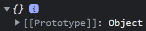

Criamos `person`, um objeto vazio mas que contém a propriedade `[[Prototype]]` como valor de `Object` .

Vamos adicionar algumas propriedades a este objeto

```js
person.name = 'John';
person.age = 35;
```

Agora, além de `[[Prototype]]`, temos as propriedades `name` e `age` em `person`.

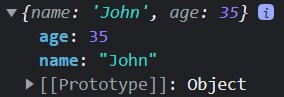

Mas afinal, o que é o `[[Prototype]]`?

`[[Prototype]]` é uma propriedade privada presente em todos os objetos JS, essa propriedade tem a referência do `prototype` do objeto atual.

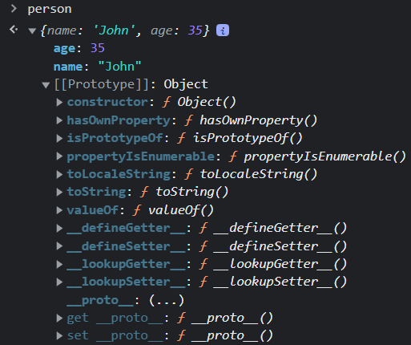

Apesar de ser uma propriedade privada de `person`, pelo browser é possível visualizar os métodos do objeto `[[Prototype]]`.

## 8.1. [[Prototype]] X \_\_proto\_\_

Como podemos perceber na imagem acima, dentro de `[[Prototype]]` existe uma propriedade `__proto__`, que é uma propriedade de `Object.prototype`. A Propriedade `__proto__` expõe `[[Prototype]]` e nos permite acessar ou modificar suas propriedades.

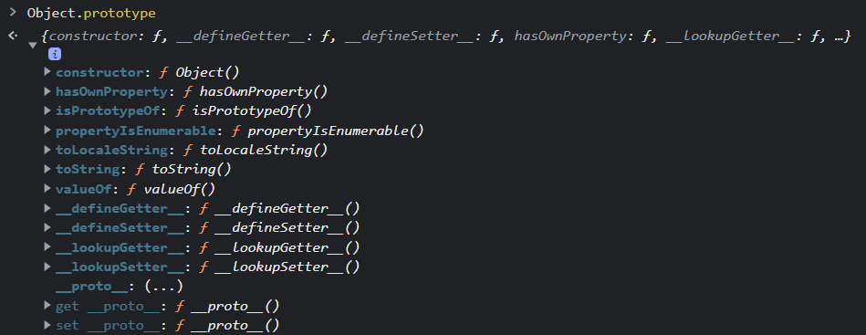

```js
person.__proto__ === Object.prototype; // => true
```

Neste caso, a asserção é valida e retorna `true` pois tanto `person.__proto__` quanto `Object.prototype` tem a referência do mesmo objeto em memória.

## 8.2. .prototype

`.prototype` é uma propriedade presente qualquer `Function Expression`.

Métodos e funções declaradas com a sintaxe de `arrow function` não recebem `.prototype`

```js
function functionExpression() {}
const arrowFunction = () => {};

functionExpression.prototype; // => {constructor: ƒ}
arrowFunction.prototype; // => undefined

const obj = {
  functionExpression: function () {},
  arrowFunction: () => {},
};

obj.functionExpression.prototype; // => {constructor: ƒ}
obj.arrowFunction.prototype; // => undefined
```

`.prototype` contêm uma referência para um objeto que será o `[[Prototype]]` do novo objeto criado quando uma função construtora for executada.

```js
function Person(name) {
  this.name = name;
}

Person.prototype; // => {constructor: ƒ}
```

  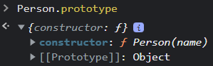

```js
const john = new Person('John');

john;
```

  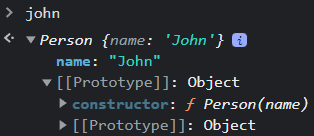

```js
john.__proto__ === Person.prototype; // => true
```

  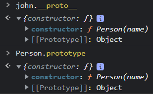

Aqui podemos observar que o objeto `john` tem como `__proto__` - a propriedade que expõe `[[Prototype]]` - um objeto que contém a função construtora `Person` como valor da propriedade `constructor`; `Person`, por sua vez, recebe a propriedade `.prototype` por ser uma `Constructor Function`.

Por convenção, as `Constructor Functions` são declaradas em `PascalCase`, com a primeira letra em maiúsculo.

> ## Sugestão de leitura

<br/>

> [JavaScript Prototype - www.javascripttutorial.net](https://www.javascripttutorial.net/javascript-prototype/)

> [JavaScript Constructor Function - www.javascripttutorial.net](https://www.javascripttutorial.net/javascript-constructor-function/)

> [Prototype in JavaScript - www.geeksforgeeks.org](https://www.geeksforgeeks.org/prototype-in-javascript/)

> [Object prototypes - MDN](https://developer.mozilla.org/en-US/docs/Learn/JavaScript/Objects/Object_prototypes)

> [Function.prototype.prototype - MDN](https://developer.mozilla.org/en-US/docs/Web/JavaScript/Reference/Global_Objects/Function/prototype)

> [Prototype in JavaScript - www.tutorialsteacher.com](https://www.tutorialsteacher.com/javascript/prototype-in-javascript)

> [JavaScript Prototype Explained with Examples - www.javascripttutorial.net](https://www.freecodecamp.org/news/javascript-prototype-explained-with-examples/)

> [F.prototype - javascript.info](https://javascript.info/function-prototype)

> [[[Prototype]] vs \_\_proto\_\_ vs .prototype in Javascript - medium.com](https://medium.com/@eamonocallaghan/prototype-vs-proto-vs-prototype-in-javascript-6758cadcbae8)

> [A Beginner’s Guide to JavaScript’s Prototype - www.freecodecamp.org](https://www.freecodecamp.org/news/a-beginners-guide-to-javascripts-prototype/)

> [Inheritance and the prototype chain - MDN](https://developer.mozilla.org/en-US/docs/Web/JavaScript/Inheritance_and_the_prototype_chain#constructors)

> [Understanding the JavaScript Prototype Chain & Inheritance - blog.risingstack.com](https://blog.risingstack.com/javascript-prototype-chain-inheritance/)

> [Understanding Prototype Chain And Inheritance in JavaScript - hackernoon.com](https://hackernoon.com/understanding-prototype-chain-and-inheritance-in-javascript-5c2w31oa)

> [Prototypal inheritance - javascript.info](https://javascript.info/prototype-inheritance)

> [JavaScript Prototypes and Inheritance – and Why They Say Everything in JS is an Object - www.freecodecamp.org](https://www.freecodecamp.org/news/prototypes-and-inheritance-in-javascript/)

> [JavaScript Prototypal Inheritance - www.javascripttutorial.net](https://www.javascripttutorial.net/javascript-prototypal-inheritance/)

> **[⬆ Voltar para o topo](#javascript---advanced-concepts)**

# async

**[⬆ Voltar para o topo](#javascript---advanced-concepts)**

# Currying

**[⬆ Voltar para o topo](#javascript---advanced-concepts)**

> [Learn JS](https://www.javascript.com/learn)

> [JavaScripting](https://www.javascripting.com/)
